# PayMyBuddy - Financial Transaction Application

This repository contains the *PayMyBuddy* application, which allows users to manage financial transactions. It includes a Spring Boot backend and MySQL database.
---

## Context

*PayMyBuddy* is an application for managing financial transactions between friends. The current infrastructure is tightly coupled and manually deployed, resulting in inefficiencies. We aim to improve scalability and streamline the deployment process using Docker and container orchestration.

---

## Infrastructure

The infrastructure will run on a Docker-enabled server with **Ubuntu 20.04**. This project includes containerizing the Spring Boot backend and MySQL database and automating deployment using Docker Compose.

### Components:

- **Backend (Spring Boot):** Manages user data and transactions
- **Database (MySQL):** Stores users, transactions, and account details
- **Orchestration:** Using Docker Compose to manage the entire application stack

---

## Application

*PayMyBuddy* is divided into two main services:

1. **Backend Service (Spring Boot):**
   - Exposes an API to handle transactions and user interactions
   - Connects to a MySQL database for persistent storage

2. **Database Service (MySQL):**
   - Stores user and transaction data
   - Exposed on port 3306 for the backend to connect

### Build and Test

#### Database Initialization
The database schema is initialized using the initdb directory, which contains SQL scripts to set up the required tables and initial data. These scripts are automatically executed when the MySQL container starts.

#### The required commands to be executed
1. **Specify the environment variables**

- export MYSQL_ROOT_PASSWORD=rootpassword
- export MYSQL_DATABASE=paymybuddy
- export MYSQL_USER=paymybuddy_user
- export MYSQL_PASSWORD=paymybuddy_pass
---
2. **Create the required network and volume**
    - docker network create paymybuddy-network

**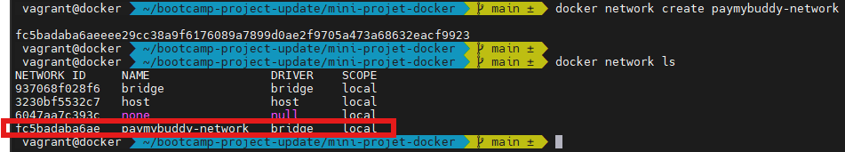**

    - docker volume create db-data

**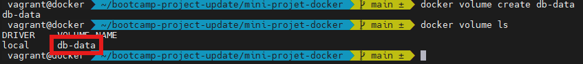**

3. **Building the backend image**
    - docker build -t transac_app:v0 .

****

4. **Runnning the database container**
- Execute the docker command
```
docker run -d \
  --name paymybuddy-db \
  -p 3306:3306 \
  --restart on-failure
  --net paymybuddy-network \
  -v db-data:/var/lib/mysql \
  -v ./initdb:/docker-entrypoint-initdb.d:ro \
  -e MYSQL_ROOT_PASSWORD=${MYSQL_ROOT_PASSWORD} \
  -e MYSQL_DATABASE=${MYSQL_DATABASE} \
  -e MYSQL_USER=${MYSQL_USER} \
  -e MYSQL_PASSWORD=${MYSQL_PASSWORD} \
  --health-cmd="mysqladmin ping -h localhost -u root -p${MYSQL_ROOT_PASSWORD}" \
  --health-interval=10s \
  --health-timeout=5s \
  --health-retries=5 \
  --health-start-period=45s \
  mysql:8.0
  ```
- Wait until the database is healthy by executing the command shown below
---
`docker inspect --format='{{.State.Health.Status}}' paymybuddy-db`

**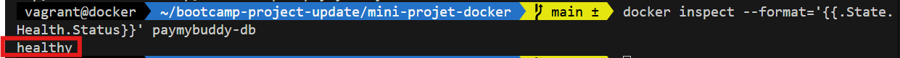**
As a result, you should get **healthy** as shown in the above picture. Otherwise, inspect the logs via `docker logs paymybuddy-db` to get further details.

- Checking the database initialization: `docker exec -it paymybuddy-db mysql -u root -prootpassword`
---

**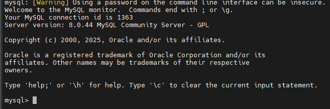**

**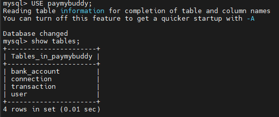**

**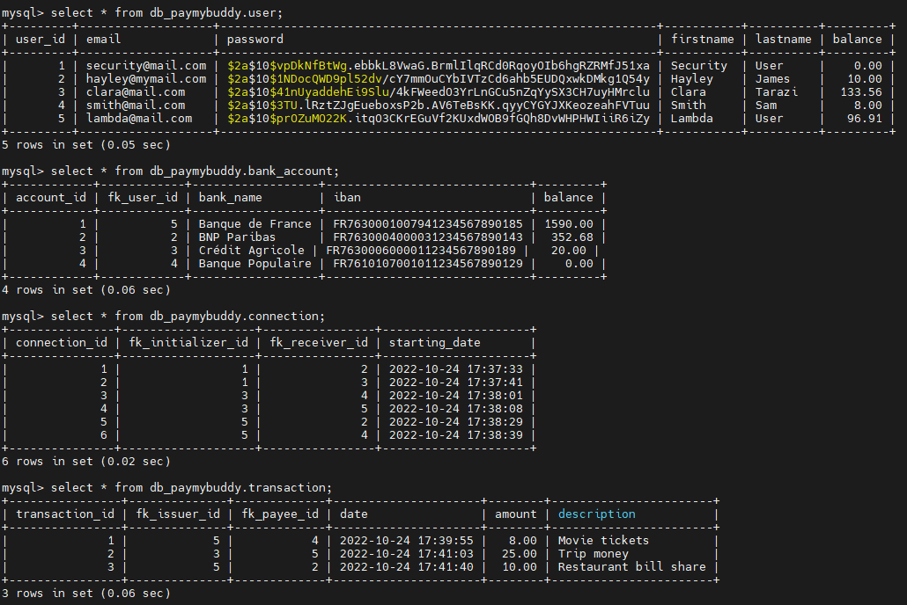**

5. **Running the backend container**
- After making sure that the database runs successfully, run this command as shown below:
```
docker run -d \
  --name paymybuddy-backend \
  --net paymybuddy-network \
  --restart on-failure \
  -p 8080:8080 \
  -e SPRING_DATASOURCE_URL="jdbc:mysql://paymybuddy-db:3306/${MYSQL_DATABASE}?serverTimezone=UTC&allowPublicKeyRetrieval=true&useSSL=false" \
  -e SPRING_DATASOURCE_USERNAME=${MYSQL_USER} \
  -e SPRING_DATASOURCE_PASSWORD=${MYSQL_PASSWORD} \
  -e SPRING_DATASOURCE_DRIVER_CLASS_NAME=com.mysql.cj.jdbc.Driver \
  -e SPRING_JPA_HIBERNATE_DDL_AUTO=update \
  -e SPRING_JPA_SHOW_SQL=true \
  -e SPRING_JPA_PROPERTIES_HIBERNATE_DIALECT=org.hibernate.dialect.MySQL8Dialect \
  transac_app
```

**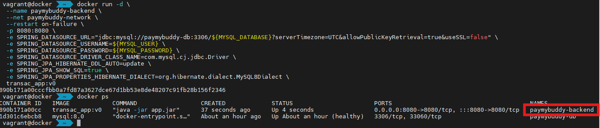**

**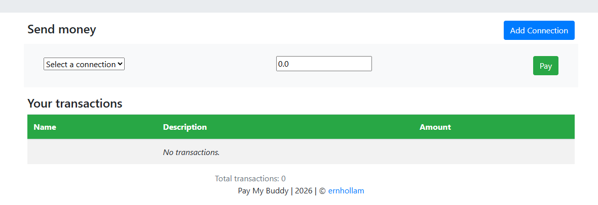**

### Orchestration with Docker Compose

The `docker-compose.yml` file will deploy both services:
- **paymybuddy-backend:** Runs the Spring Boot application.
- **paymybuddy-db:** MySQL database to handle user data and transactions. 
---

#### Prerequisites
1. Docker Compose installation
Before anything, make sure that `docker-compose` is installed. Otherwise, run the commands mentionned below:

- `sudo curl -SL https://github.com/docker/compose/releases/download/v2.23.3/docker-compose-linux-x86_64 -o /usr/local/bin/docker-compose`
- `sudo chmod +x /usr/local/bin/docker-compose`
- `docker-compose -v` 
---
2. **Create a .env file**
- vi .env
- Copy and paste the following variables inside the .env file
```
MYSQL_ROOT_PASSWORD=rootpassword
MYSQL_DATABASE=paymybuddy
MYSQL_USER=paymybuddy_user
MYSQL_PASSWORD=paymybuddy_pass
```
---
**NB:** Do not forget not to commit the .env file. Otherwise, the security department will not be happy with you!
#### Running the app
- Step 1: Starting and Checking the services
  - docker-compose up -d
  - docker ps
---
As a result you should have your services that have started successfully with a healthy database.

**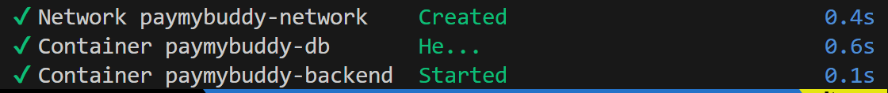**

- Step 2: Now, we can check whether the app is working as expected.

---
**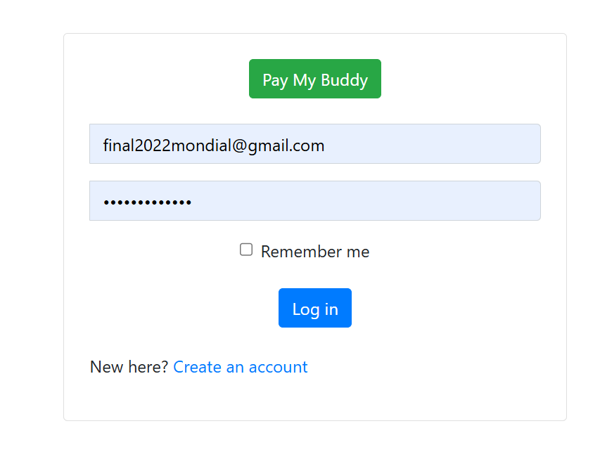**
---

## Docker Registry

We desire to push the images to a private Docker registry and deploy them using Docker Compose.

### Steps:
1. Build the images for both backend and MySQL (to be done on the local machine)
    - docker pull mysql:8.0
    - docker build -t transac_app .
    - docker tag mysql:8.0 your_remote_machine_ip:5000/mysql:8.0
    - docker tag transac_app:latest your_remote_machine_ip:5000/transac_app:v0

2. Deploy a private Docker registry (to be done on the remote machine)
    - Create the Docker Network: `docker network create registry_net`
    - Start the Docker Registry used as a private registry: 
```
docker run -d \
  -p 5000:5000 \
  --net registry_net \
  --name registry-kevin \
  registry:2.8.1
```
- Start the Docker Registry UI to manage the registry:

```
docker run -d \
  -p 8090:80 \
  --net registry_net \
  -e NGINX_PROXY_PASS_URL=http://registry-kevin:5000 \
  -e DELETE_IMAGES=true \
  -e REGISTRY_TITLE=kevinconsulting \
  --name frontend-kevin \
  joxit/docker-registry-ui:2
```

**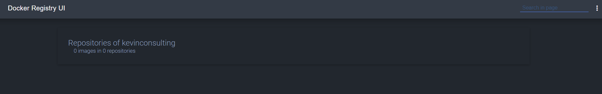**

3. Push your images to the private registry (to be done on the local machine)

- docker push your_remote_machine_ip:5000/mysql:8.0
- docker push your_remote_machine_ip:5000/transac_app:v0

**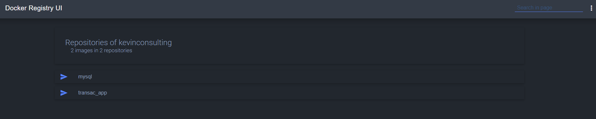**

**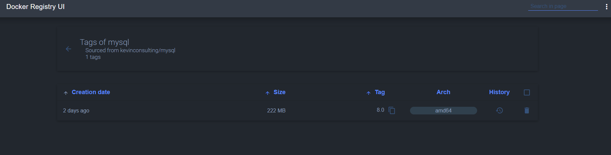**

**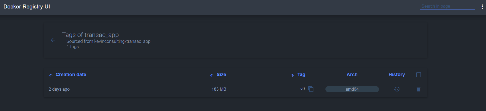**

4. Use the images (from the private registry) in `docker-compose.yml`

**NB:** Replace the <your_remote_machine_ip> by its corresponding value.