# 💰 PayMyBuddy - Financial Transaction Application

A containerized financial transaction management application using Docker and Docker Compose.

---

## 📋 Table of Contents

- [Overview](#-overview)
- [Architecture](#-architecture)
- [Prerequisites](#-prerequisites)
- [Manual Deployment](#-manual-deployment)
  - [Step 1: Environment Variables](#step-1-environment-variables)
  - [Step 2: Create Network and Volume](#step-2-create-network-and-volume)
  - [Step 3: Build Backend Image](#step-3-build-backend-image)
  - [Step 4: Run Database Container](#step-4-run-database-container)
  - [Step 5: Run Backend Container](#step-5-run-backend-container)
- [Docker Compose Deployment](#-docker-compose-deployment)
- [Private Docker Registry](#-private-docker-registry)
  - [Using Docker Run](#using-docker-run)
  - [Using Docker Compose](#using-docker-compose)
- [Troubleshooting](#-troubleshooting)

---

## 🎯 Overview

**PayMyBuddy** is an application for managing financial transactions between friends. This project focuses on containerizing the application stack and automating deployment using Docker and Docker Compose.

### ✨ Features

| Feature | Description |
|---------|-------------|
| 💳 **Transaction Management** | Send and receive money between friends |
| 👥 **User Management** | User registration and authentication |
| 🐳 **Containerized** | Fully Dockerized application stack |
| 🔄 **Orchestration** | Docker Compose for multi-container management |
| 📦 **Private Registry** | Support for private Docker registry deployment |

### 🛠️ Tech Stack

| Component | Technology |
|-----------|------------|
| Backend | Spring Boot |
| Database | MySQL 8.0 |
| Container Runtime | Docker |
| Orchestration | Docker Compose |
| Server OS | Ubuntu 20.04 |

---

## 🏗️ Architecture
```
┌─────────────────────────────────────────────────────────────────┐
│                    PAYMYBUDDY ARCHITECTURE                       │
├─────────────────────────────────────────────────────────────────┤
│                                                                  │
│                         ┌─────────────┐                         │
│                         │   Browser   │                         │
│                         │  (Client)   │                         │
│                         └──────┬──────┘                         │
│                                │                                 │
│                                ▼                                 │
│                         ┌─────────────┐                         │
│                         │  Port 8080  │                         │
│                         └──────┬──────┘                         │
│                                │                                 │
│  ┌─────────────────────────────┴─────────────────────────────┐  │
│  │                  paymybuddy-network                        │  │
│  │                                                            │  │
│  │   ┌────────────────────┐      ┌────────────────────┐      │  │
│  │   │  paymybuddy-backend│      │   paymybuddy-db    │      │  │
│  │   │    (Spring Boot)   │─────▶│     (MySQL 8.0)    │      │  │
│  │   │                    │      │                    │      │  │
│  │   │    Port: 8080      │      │    Port: 3306      │      │  │
│  │   └────────────────────┘      └─────────┬──────────┘      │  │
│  │                                         │                  │  │
│  └─────────────────────────────────────────┼──────────────────┘  │
│                                            │                     │
│                                            ▼                     │
│                                   ┌────────────────┐            │
│                                   │    db-data     │            │
│                                   │   (Volume)     │            │
│                                   └────────────────┘            │
│                                                                  │
└─────────────────────────────────────────────────────────────────┘
```

### 📦 Components

| Service | Description | Port |
|---------|-------------|------|
| **paymybuddy-backend** | Spring Boot API for transactions and user management | 8080 |
| **paymybuddy-db** | MySQL database for persistent storage | 3306 |

---

## 🔧 Prerequisites

| Requirement | Version |
|-------------|---------|
| Docker | Latest |
| Docker Compose | v2.23.3+ |
| Ubuntu Server | 20.04 LTS |

### 📥 Install Docker Compose
```bash
# Download Docker Compose
sudo curl -SL https://github.com/docker/compose/releases/download/v2.23.3/docker-compose-linux-x86_64 -o /usr/local/bin/docker-compose

# Make it executable
sudo chmod +x /usr/local/bin/docker-compose

# Verify installation
docker-compose -v
```

---

## 🚀 Manual Deployment

### Step 1: Environment Variables

Set up the required environment variables:
```bash
export MYSQL_ROOT_PASSWORD=rootpassword
export MYSQL_DATABASE=paymybuddy
export MYSQL_USER=paymybuddy_user
export MYSQL_PASSWORD=paymybuddy_pass
```

---

### Step 2: Create Network and Volume
```bash
# Create Docker network
docker network create paymybuddy-network
```

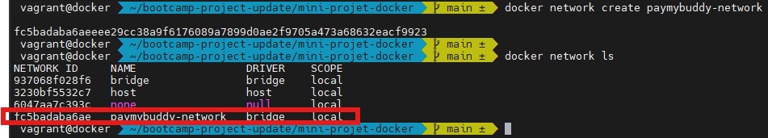
```bash
# Create Docker volume for database persistence
docker volume create db-data
```

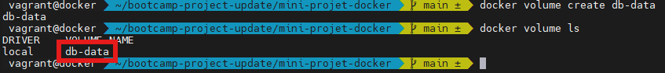

---

### Step 3: Build Backend Image
```bash
docker build -t transac_app:v0 .
```

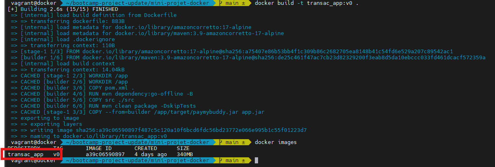

✅ **Expected result:** Image built successfully.

---

### Step 4: Run Database Container
```bash
docker run -d \
  --name paymybuddy-db \
  -p 3306:3306 \
  --restart on-failure \
  --net paymybuddy-network \
  -v db-data:/var/lib/mysql \
  -v ./initdb:/docker-entrypoint-initdb.d:ro \
  -e MYSQL_ROOT_PASSWORD=${MYSQL_ROOT_PASSWORD} \
  -e MYSQL_DATABASE=${MYSQL_DATABASE} \
  -e MYSQL_USER=${MYSQL_USER} \
  -e MYSQL_PASSWORD=${MYSQL_PASSWORD} \
  --health-cmd="mysqladmin ping -h localhost -u root -p${MYSQL_ROOT_PASSWORD}" \
  --health-interval=10s \
  --health-timeout=5s \
  --health-retries=5 \
  --health-start-period=45s \
  mysql:8.0
```

#### 🔍 Verify Database Health
```bash
# Check health status (wait for "healthy")
docker inspect --format='{{.State.Health.Status}}' paymybuddy-db
```

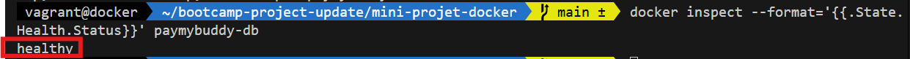

✅ **Expected result:** Status shows `healthy`.

#### 🔍 Verify Database Initialization
```bash
# Connect to MySQL
docker exec -it paymybuddy-db mysql -u root -prootpassword
```

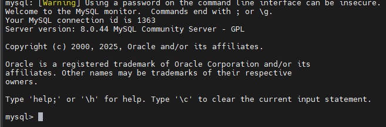
```sql
-- Check tables
SHOW DATABASES;
USE paymybuddy;
SHOW TABLES;
```

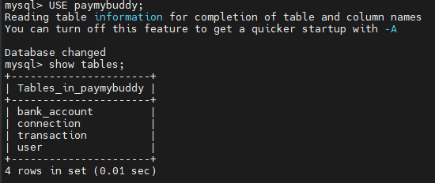

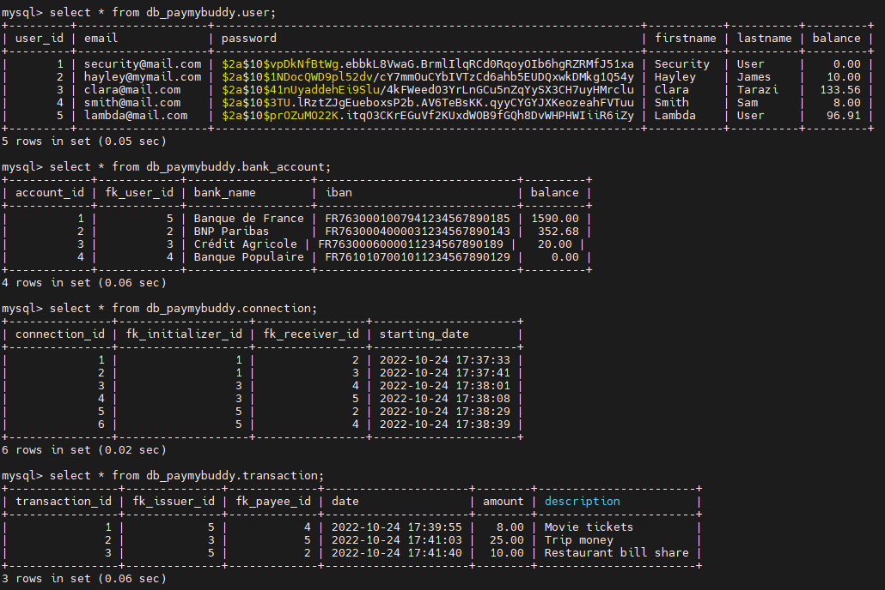

---

### Step 5: Run Backend Container
```bash
docker run -d \
  --name paymybuddy-backend \
  --net paymybuddy-network \
  --restart on-failure \
  -p 8080:8080 \
  -e SPRING_DATASOURCE_URL="jdbc:mysql://paymybuddy-db:3306/${MYSQL_DATABASE}?serverTimezone=UTC&allowPublicKeyRetrieval=true&useSSL=false" \
  -e SPRING_DATASOURCE_USERNAME=${MYSQL_USER} \
  -e SPRING_DATASOURCE_PASSWORD=${MYSQL_PASSWORD} \
  -e SPRING_DATASOURCE_DRIVER_CLASS_NAME=com.mysql.cj.jdbc.Driver \
  -e SPRING_JPA_HIBERNATE_DDL_AUTO=update \
  -e SPRING_JPA_SHOW_SQL=true \
  -e SPRING_JPA_PROPERTIES_HIBERNATE_DIALECT=org.hibernate.dialect.MySQL8Dialect \
  transac_app:v0
```

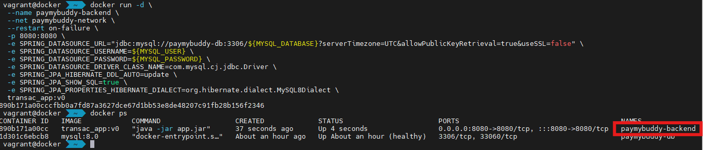

#### 🌐 Access the Application

Open your browser and navigate to: `http://<SERVER_IP>:8080`

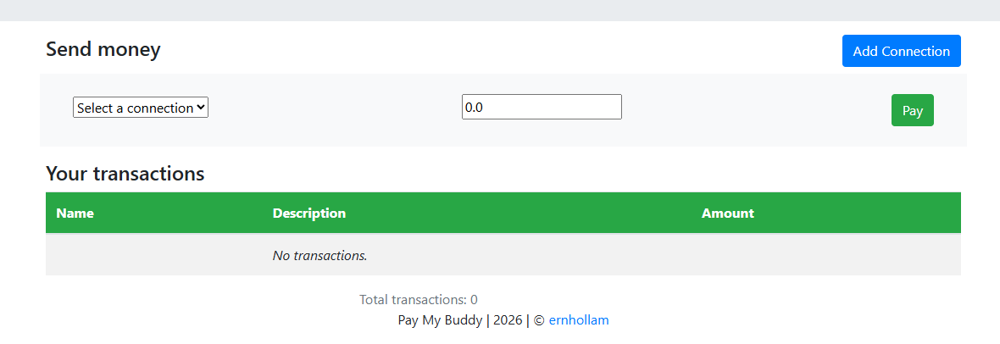

✅ **Manual deployment complete!**

---

## 🐳 Docker Compose Deployment

Docker Compose simplifies the deployment by managing all services in a single configuration file.

### Step 1: Create Environment File

Create a `.env` file with your credentials:
```bash
vi .env
```
```env
MYSQL_ROOT_PASSWORD=rootpassword
MYSQL_DATABASE=paymybuddy
MYSQL_USER=paymybuddy_user
MYSQL_PASSWORD=paymybuddy_pass
```

> ⚠️ **Security Warning:** Never commit the `.env` file to version control!

### Step 2: Clean Previous Resources

If you deployed manually before, clean up:
```bash
# Remove containers
docker rm -f paymybuddy-backend paymybuddy-db

# Remove image
docker rmi -f transac_app:v0

# Remove volume
docker volume rm db-data

# Remove network
docker network rm paymybuddy-network
```

### Step 3: Deploy with Docker Compose
```bash
# Start all services
docker-compose -f docker-compose.yml up -d

# Verify services
docker ps
```

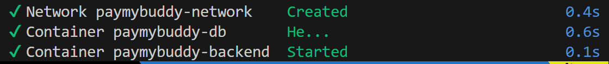

✅ **Expected result:** All services running with healthy database.

### Step 4: Access the Application

Open your browser and navigate to: `http://192.168.56.5:8080`

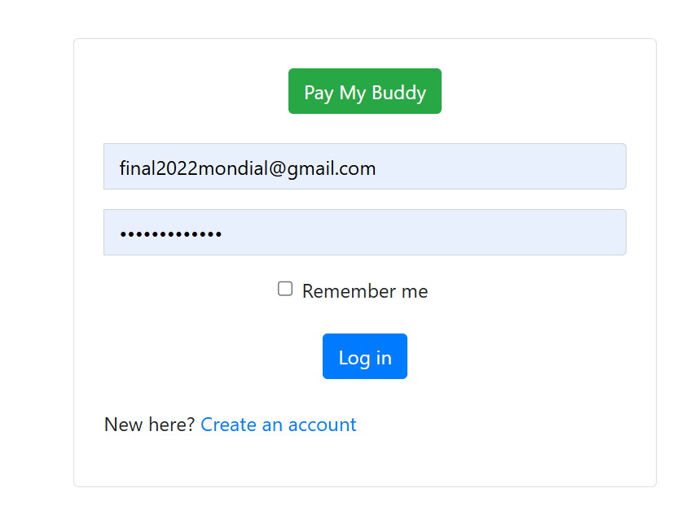


---

## 📦 Private Docker Registry

Deploy images using a private Docker registry for better security and control.

### Architecture with Private Registry
```
┌─────────────────────────────────────────────────────────────────┐
│                    PRIVATE REGISTRY SETUP                        │
├─────────────────────────────────────────────────────────────────┤
│                                                                  │
│  ┌─────────────────────────────────────────────────────────┐    │
│  │                   registry-network                       │    │
│  │                                                          │    │
│  │   ┌──────────────────┐      ┌──────────────────┐        │    │
│  │   │ private-registry │      │ registry-frontend│        │    │
│  │   │   (registry:2)   │◀─────│  (docker-ui)     │        │    │
│  │   │   Port: 5000     │      │   Port: 8090     │        │    │
│  │   └──────────────────┘      └──────────────────┘        │    │
│  │            │                                             │    │
│  └────────────┼─────────────────────────────────────────────┘    │
│               │                                                  │
│               ▼                                                  │
│   ┌───────────────────────────────────────────────────┐         │
│   │              Stored Images                         │         │
│   │  • localhost:5000/mysql:8.0                       │         │
│   │  • localhost:5000/transac_app:v0                  │         │
│   └───────────────────────────────────────────────────┘         │
│                                                                  │
└─────────────────────────────────────────────────────────────────┘
```

---

### Using Docker Run

#### Step 1: Build and Tag Images (Local Machine)
```bash
# Pull and tag MySQL
docker pull mysql:8.0
docker tag mysql:8.0 <REGISTRY_URL>/mysql:8.0

# Build and tag backend
docker build -t transac_app:v0 .
docker tag transac_app:v0 <REGISTRY_URL>/transac_app:v0
```

#### Step 2: Deploy Private Registry (Remote Machine)
```bash
# Create network
docker network create registry-network

# Start registry
docker run -d \
  -p 5000:5000 \
  --net registry-network \
  --name private-registry \
  registry:2.8.1

# Start registry UI
docker run -d \
  -p 8090:80 \
  --net registry-network \
  -e NGINX_PROXY_PASS_URL=http://private-registry:5000 \
  -e DELETE_IMAGES=true \
  -e REGISTRY_TITLE=kevinconsulting \
  --name private-registry-frontend \
  joxit/docker-registry-ui:2
```

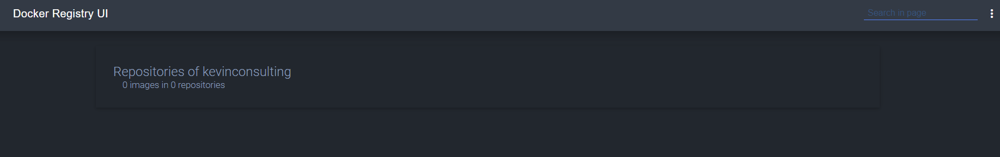

#### Step 3: Push Images (Local Machine)
```bash
docker push <REGISTRY_URL>/mysql:8.0
docker push <REGISTRY_URL>/transac_app:v0
```

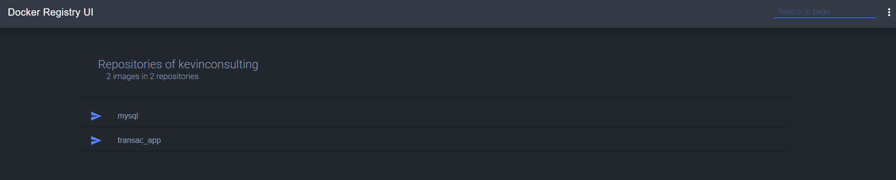

#### 🔍 Verify Images in Registry
```bash
curl http://localhost:5000/v2/_catalog
```

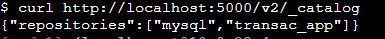

| Image | Details |
|-------|---------|
| MySQL | 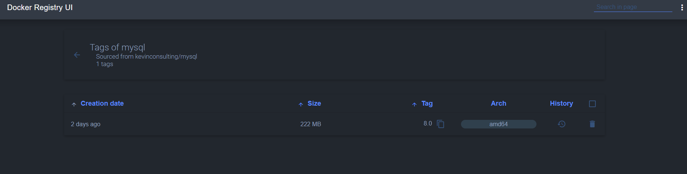 |
| Backend | 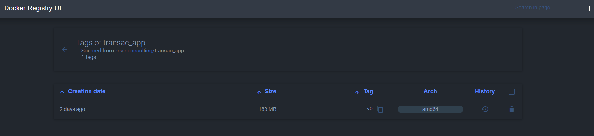 |

---

### Using Docker Compose

#### Step 1: Start Registry Services
```bash
docker-compose -f docker-compose-registry.yml up -d private-registry private-registry-frontend
```

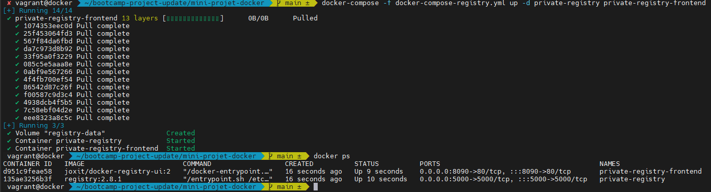

#### Step 2: Build and Push Images
```bash
# Pull MySQL and push to private registry
docker pull mysql:8.0
docker tag mysql:8.0 localhost:5000/mysql:8.0
docker push localhost:5000/mysql:8.0

# Build backend and push to private registry
docker build -t transac_app:v0 .
docker tag transac_app:v0 localhost:5000/transac_app:v0
docker push localhost:5000/transac_app:v0
```

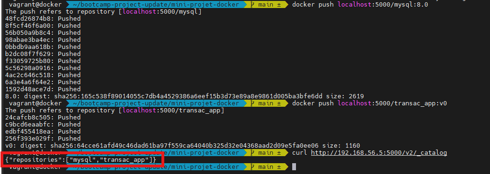

#### Step 3: Deploy Application
```bash
# Start application services
docker-compose -f docker-compose-registry.yml up -d paymybuddy-db paymybuddy-backend

# Verify services
docker-compose ps
```

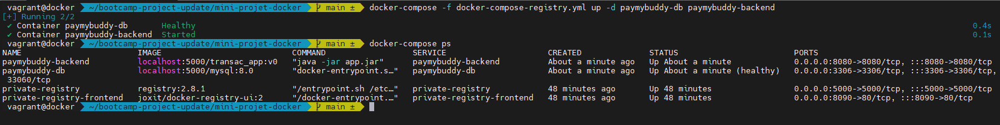

#### 🌐 Access the Application

Open your browser and navigate to: `http://192.168.56.5:8080`


✅ **Private registry deployment complete!**

---

## 🛠️ Troubleshooting

| Issue | Possible Cause | Solution |
|-------|----------------|----------|
| Database not healthy | Initialization scripts failing | Check logs: `docker logs paymybuddy-db` |
| Backend can't connect to DB | Network issues | Verify both containers are on same network |
| Port already in use | Another service using port | Stop conflicting service or change port |
| Image push fails | Registry not accessible | Verify registry is running and accessible |
| Permission denied | Docker socket permissions | Add user to docker group: `sudo usermod -aG docker $USER` |

### 🔍 Useful Commands
```bash
# Check container logs
docker logs paymybuddy-backend
docker logs paymybuddy-db

# Check container health
docker inspect --format='{{.State.Health.Status}}' paymybuddy-db

# List networks
docker network ls

# List volumes
docker volume ls

# Check registry catalog
curl http://localhost:5000/v2/_catalog

# Enter container shell
docker exec -it paymybuddy-backend /bin/sh
docker exec -it paymybuddy-db mysql -u root -p
```

---

## 📁 Project Structure
```
paymybuddy/
├── docker-compose.yml              # Main deployment file
├── docker-compose-registry.yml     # Registry deployment file
├── Dockerfile                      # Backend image definition
├── .env                            # Environment variables (DO NOT COMMIT)
├── .env.example                    # Environment template
├── initdb/
│   └── init.sql                    # Database initialization scripts
├── src/                            # Spring Boot source code
├── images/                         # Documentation images
└── README.md
```

---

## 📊 Deployment Options Summary

| Method | Complexity | Use Case |
|--------|------------|----------|
| Manual (`docker run`) | High | Learning, debugging |
| Docker Compose | Low | Development, small deployments |
| Private Registry + Compose | Medium | Production, team environments |

---

## 📚 Resources

- [Docker Documentation](https://docs.docker.com/)
- [Docker Compose Documentation](https://docs.docker.com/compose/)
- [Spring Boot Docker Guide](https://spring.io/guides/gs/spring-boot-docker/)
- [MySQL Docker Image](https://hub.docker.com/_/mysql)

---

## 👨‍💻 Author

**Kevin Lagaza**

---

## 📄 License

This project is licensed under the MIT License.